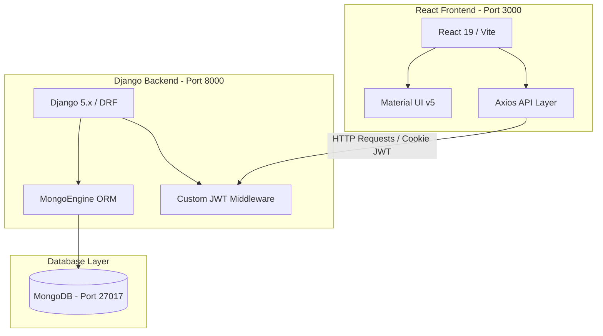

# TT Cell Vocational Training Management Portal (TTC-VTP)

An enterprise-grade, role-based management portal designed for managing vocational training programs at the **Army Base Workshop TT Cell**.

This repository consists of a decoupled architecture with a React-based frontend and a Django + MongoDB backend.

---

## 🏗️ Project Architecture & Tech Stack



### Technology Stack
* **Frontend**: React 19, Vite, Material UI (MUI) v5, React Router DOM v6, Axios, React Context API (Auth/Role-based access).
* **Backend**: Django 5.0+, Django REST Framework (DRF), MongoEngine (MongoDB ODM), PyJWT (RS256 token signing), `django-cors-headers`, `django-ratelimit`.
* **Database**: MongoDB (v4.4+ recommended).

---

## 📂 Repository Structure & Key Files

The project is organized into two primary sibling folders under this root directory:

```text
TT-CELL-VOCATIONAL-TRAINING-main/
├── README.md                 # Root documentation (this file)
├── ttcell/                   # Frontend React Application
│   ├── src/
│   │   ├── api/
│   │   │   ├── axiosInstance.js  # Axios client with automatic token refresh (JWT)
│   │   │   ├── authApi.js        # Auth-related endpoints (login, forgot-password, reset-password)
│   │   │   └── portalApi.js      # Core business APIs (Trainees, Projects, Attendance, Analytics, Settings, Reports)
│   │   ├── context/
│   │   │   └── AuthContext.jsx   # Authentication context & state management
│   │   ├── pages/
│   │   │   ├── auth/             # Login, Forgot & Reset Password pages
│   │   │   ├── admin/            # Admin Panel pages (Dashboard, Trainees, Projects, Attendance, Analytics, Settings, Reports, Repository)
│   │   │   └── trainee/          # Trainee Dashboard pages (Dashboard, Profile, Attendance, Projects, Announcements)
│   │   └── components/
│   │       ├── UIComponents.jsx  # Styled reusable metric cards, charts, and grids
│   │       └── Navigation.jsx    # Sidebar navigation & Layouts
│   ├── vite.config.js        # Vite config with API reverse-proxy setup
│   └── package.json          # Node dependencies & scripts
│
└── ttc_backend/              # Backend Django Application
    ├── apps/
    │   ├── authentication/   # User models, authentication views, dashboard views, settings & analytics APIs
    │   ├── trainees/         # Trainee profiles & details management (CSV import/CRUD)
    │   ├── projects/         # Project details, assignments, and histories
    │   ├── attendance/       # Attendance logs & bulk-mark service
    │   └── announcements/    # Notifications & announcements
    ├── core/
    │   ├── db.py             # MongoEngine connection bootstrap
    │   ├── authentication.py # Django/DRF authentication backend bridge
    │   ├── responses.py      # Standardized success/error API payloads
    │   └── exceptions.py     # Custom API exception formatting
    ├── middleware/
    │   └── jwt_middleware.py # RS256 Bearer cookie validation middleware
    ├── ttc_project/
    │   ├── settings.py       # Configuration settings (lockout, rate-limiting, MongoDB settings)
    │   └── urls.py           # Main routing entry point
    ├── requirements.txt      # Python dependencies
    └── manage.py             # Django CLI runner
```

---

## ⚡ Key Features

### 👨‍💼 Admin Panel
1. **Dashboard**: High-level real-time stats including total trainees, active projects, average attendance, at-risk trainee count, and a 6-week attendance history chart.
2. **Trainee Management**: Complete CRUD operations, domain filter, text search, and a CSV bulk import utility.
3. **Project Management**: Creation, deletion, scoring, archiving/unarchiving, and direct trainee assignments with optional deadline overrides.
4. **Attendance Register**: Interactive, single-screen register to view or bulk-mark daily presence, absences, or leaves with custom notes.
5. **Announcements Engine**: Internal messaging engine supporting drafts, priority coding (High/Medium/Low), target audience selection, and instant trainee broadcasts.
6. **Analytics Portal**: In-depth analytical views displaying project completion rates, domain-wise score breakdowns, dropout rates, attendance distribution, and ranked top performers.
7. **CSV Report Generator**: Real-time CSV generation and streaming downloads for critical reporting metrics, including Attendance Summaries, Project Progress, Cohort Performance, and MoD Compliance datasets.
8. **Settings Configurations**: System-wide control panel to update organisation parameters (thresholds, timeout durations, academic year) and email alert triggers.

### 🎓 Trainee Portal
1. **Personal Dashboard**: Personal greeting, overall attendance percentage, completed/assigned project counters, composite standing score, current project status, and active announcements.
2. **Profile & Documents**: Profile view displaying individual bio details and training tracks.
3. **Attendance History**: Date-wise attendance logs, check-in timestamps, status tags, and leave logs.
4. **Projects Hub**: Live track showing progress percentages, tech stacks, and individual scores for all assigned capstones.
5. **Notifications**: Targeted notice board rendering priority-coded announcements published by administrators.

---

## 🚀 How to Run the Project

### Prerequisite: Start MongoDB
Ensure MongoDB is running locally on port `27017`. You can connect to it using MongoDB Compass with the URI:
```text
mongodb://localhost:27017
```
The application database is automatically created and named `ttcell_db`.

---

### Step 1: Start the Backend (Port 8000)

1. Open a terminal and navigate to the backend directory:
   ```cmd
   cd ttc_backend
   ```
2. Activate the pre-configured Python virtual environment:
   * **PowerShell:**
     ```powershell
     .\venv\Scripts\Activate.ps1
     ```
   * **Command Prompt (CMD):**
     ```cmd
     venv\Scripts\activate
     ```
3. Start the Django development server:
   ```bash
   python manage.py runserver 8000
   ```

*To run tests on the backend, execute:*
```bash
venv\Scripts\pytest -v --tb=short
```

---

### Step 2: Start the Frontend (Port 3000)

1. Open a **new, separate terminal** window and navigate to the frontend directory:
   ```cmd
   cd ttcell
   ```
2. Install npm packages (if not already installed):
   ```bash
   npm install
   ```
3. Run the frontend development server:
   ```bash
   npm run dev
   ```
4. Open your browser and navigate to `http://localhost:3000`.

---

## 🔑 Default Seed Credentials

Use these credentials to log in and inspect the features:

* **Admin Role:**
  * **Email**: `admin@ttcell`
  * **Password**: `password`
* **Trainee / Student Role:**
  * **Email**: `trainee@ttcell`
  * **Password**: `ChangeMeOnFirstLogin!`

---

## 🛡️ Authentication Flow Context
1. **JWT Handshake**: Users authenticate with their email and password. The backend returns an access token in the JSON body and a secure `httpOnly` refresh token in a cookie.
2. **Auto Refresh**: The frontend's `axiosInstance.js` automatically catches `401 Unauthorized` responses, calls `/api/v1/auth/refresh/` using the refresh cookie, rotates the tokens, and retries the failed API request seamlessly.
3. **Password Resets**: Supported via password reset tokens. The backend outputs these in `DEBUG` mode, which can be seen in testing and console outputs to complete the reset form at `/reset-password?token=...`.
