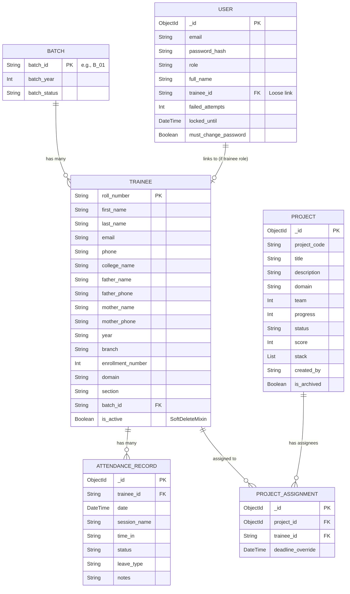

# TT Cell Vocational Training Portal - Database Schema

The backend uses **MongoDB** with **MongoEngine ORM**. The collections have been recently normalized (e.g. extracting `Batch` into its own entity).

## Entity-Relationship (ER) Diagram
Below is the Mermaid ER diagram visualizing the relationships between the MongoDB collections. 
*(Note: While MongoDB is NoSQL, MongoEngine enforces these relational links via `ReferenceField`)*

## Schema Breakdown

### 1. `batches` Collection
Stores cohorts of trainees.
* `batch_id` (Primary Key, String): Unique identifier (e.g. `B_01`)
* `batch_year` (Integer): Year of the batch (e.g. `2024`)
* `batch_status` (String): `active` or `completed`

### 2. `trainees` Collection
Stores student profiles with recently added demographic and academic fields.
* `roll_number` (Primary Key, String)
* `batch_id` (Reference): Links to `Batch`.
* `first_name`, `last_name`, `email`, `phone`
* `college_name`, `father_name`, `father_phone`, `mother_name`, `mother_phone`
* `year` (`II` or `III`), `branch`, `enrollment_number`, `section` (`A`, `B`, `C`, `D`), `domain`
* *Inherits `AuditLogMixin` and `SoftDeleteMixin` (`is_active`)*

### 3. `attendance_records` Collection
Tracks daily attendance.
* `trainee_id` (Reference): Links to `Trainee`. Cascade deleted if Trainee is hard-deleted.
* `date` (DateTime): Normalized to midnight UTC.
* `status` (String): `present`, `absent`, or `leave`.
* `session_name`, `time_in`, `leave_type`, `notes`
* *Compound Unique Index on (`trainee_id`, `date`)*

### 4. `projects` & `project_assignments` Collections
Handles capstone projects and associations.
* **`projects`**: Stores project metadata (`project_code`, `title`, `domain`, `status`, `progress`, `score`, etc.)
* **`project_assignments`**: A junction collection connecting a `Trainee` to a `Project` (with an optional `deadline_override`).

### 5. `users` Collection
Handles authentication and RBAC (Role Based Access Control).
* `email`, `password_hash`, `role` (`admin` or `trainee`), `full_name`
* `trainee_id` (String): If the user is a trainee, this holds their `roll_number` to link them to their profile.
* Includes security fields like `failed_attempts`, `locked_until`, and `must_change_password`.

*(There are also minor collections not diagrammed above such as `audit_logs`, `portal_settings`, `refresh_tokens`, and `blacklisted_tokens` handling system internals).*
